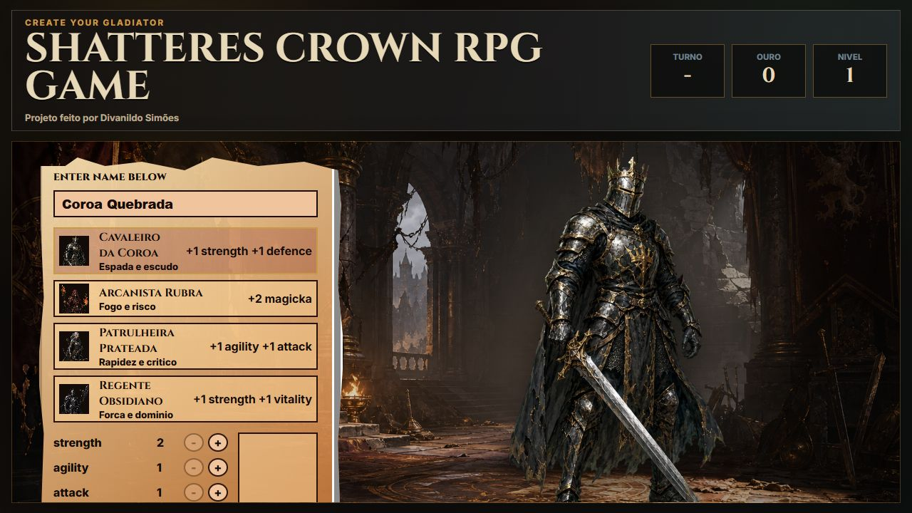
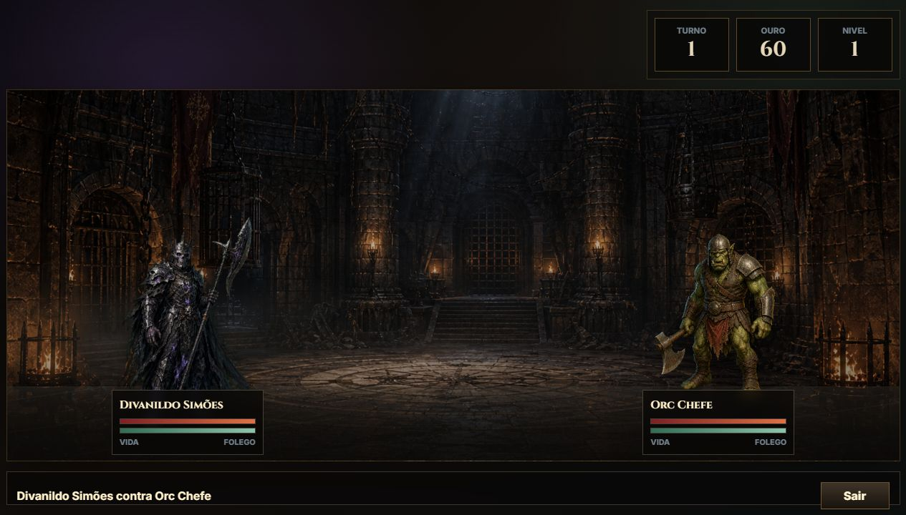

# SHATTERES CROWN RPG GAME

Projeto feito por **Divanildo Simões**.

**SHATTERES CROWN RPG GAME** é um jogo RPG de arena medieval feito com HTML, CSS e JavaScript puro. O jogador cria um personagem, distribui pontos de habilidade, entra em batalhas por turnos, vence inimigos, ganha ouro e pode visitar a loja para evoluir sua jornada.

## Sobre o projeto

O jogo foi criado para rodar localmente no navegador usando `localhost`. Ele não precisa de banco de dados, framework ou instalação de dependências externas.

O projeto contém:

- Tela inicial com criação de personagem.
- Escolha de classe e distribuição de pontos.
- Menu principal com acesso para batalha, loja e treino.
- Sistema de batalha por turnos.
- Inimigos como Orc da Arena e Orc Chefe.
- Loja com itens que melhoram atributos.
- Cenários medievais para arena, loja e batalhas especiais.

## Tecnologias usadas

- HTML5
- CSS3
- JavaScript
- Node.js apenas para servir o projeto em `localhost`

## Como rodar localmente

1. Tenha o Node.js instalado.
2. Abra o terminal na pasta do projeto.
3. Execute:

```bash
npm start
```

4. Abra no navegador:

```text
http://localhost:3000
```

## Estrutura do projeto

```text
SHATTERES CROWN RPG GAME
├── assets/
│   ├── backgrounds/
│   └── personagens e inimigos
├── docs/
│   └── screenshots/
├── index.html
├── styles.css
├── script.js
├── server.js
├── package.json
└── README.md
```

## Imagens do projeto

### Tela inicial



### Menu principal


### Loja


### Batalha contra Orc simples


### Batalha contra Orc Chefe



## Autor

Feito por **Divanildo Simões**.
